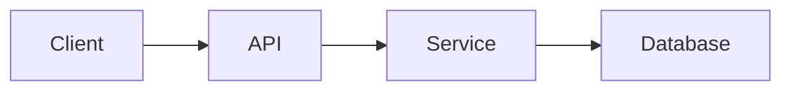

# RFC Template Standard

## Revision History

| Version | Date | Description |
|---------|------|-------------|
| 1.0.0 | YYYY-MM-DD | Initial enterprise RFC template standard. |

---

## Table of Contents

1. [Purpose](#1-purpose)
2. [Scope](#2-scope)
3. [RFC Philosophy](#3-rfc-philosophy)
4. [RFC Lifecycle](#4-rfc-lifecycle)
5. [RFC Categories](#5-rfc-categories)
6. [RFC Numbering](#6-rfc-numbering)
7. [RFC Metadata](#7-rfc-metadata)
8. [Metadata Field Definitions](#8-metadata-field-definitions)
9. [Document Control](#9-document-control)
10. [RFC Writing Rules](#10-rfc-writing-rules)
11. [Executive Summary](#11-executive-summary)
12. [Problem Statement](#12-problem-statement)
13. [Background](#13-background)
14. [Goals](#14-goals)
15. [Non-Goals](#15-non-goals)
16. [Success Criteria](#16-success-criteria)
17. [Requirements](#17-requirements)
18. [Current State](#18-current-state)
19. [Constraints](#19-constraints)
20. [Assumptions](#20-assumptions)
21. [Dependencies](#21-dependencies)
22. [Proposed Solution](#22-proposed-solution)
23. [Design Details](#23-design-details)
24. [Alternatives Considered](#24-alternatives-considered)
25. [Decision Rationale](#25-decision-rationale)
26. [Trade-offs](#26-trade-offs)
27. [Impact Analysis](#27-impact-analysis)
28. [Architecture Impact](#28-architecture-impact)
29. [Domain Impact](#29-domain-impact)
30. [API Impact](#30-api-impact)
31. [Database Impact](#31-database-impact)
32. [Security Impact](#32-security-impact)
33. [Performance Impact](#33-performance-impact)
34. [Scalability Impact](#34-scalability-impact)
35. [Reliability Impact](#35-reliability-impact)
36. [Operational Impact](#36-operational-impact)
37. [Migration Strategy](#37-migration-strategy)
38. [Rollback Strategy](#38-rollback-strategy)
39. [Testing Strategy](#39-testing-strategy)
40. [Deployment Strategy](#40-deployment-strategy)
41. [Monitoring Strategy](#41-monitoring-strategy)
42. [Operational Runbook](#42-operational-runbook)
43. [Open Questions](#43-open-questions)
44. [Risks Register](#44-risks-register)
45. [Acceptance Criteria](#45-acceptance-criteria)
46. [Success Metrics](#46-success-metrics)
47. [References](#47-references)
48. [Review Checklist](#48-review-checklist)
49. [Approval Process](#49-approval-process)
50. [Appendices](#50-appendices)
51. [Glossary](#51-glossary)
52. [Final RFC Completion Checklist](#52-final-rfc-completion-checklist)
53. [RFC Template Usage Rules](#53-rfc-template-usage-rules)

---

# 1. Purpose

## Objective

This template defines the official structure for every Request for Comments (RFC)
created within the AURA Engineering Specification repository.

Every engineering proposal that may influence architecture, product behavior,
business logic, infrastructure, APIs, databases, security, or operational
procedures SHALL be documented using this template.

The objective of this template is to ensure that every engineering proposal is:

- Structured
- Reviewable
- Traceable
- Comparable
- Maintainable
- AI-readable
- Human-readable

RFC documents exist to support engineering decision-making before
implementation begins.

Implementation SHALL never become the primary source of engineering decisions.

## Intended Use

Use this template when proposing a change that could affect:

- System architecture
- Domain boundaries
- API contracts
- Database schema
- Security posture
- Infrastructure design
- Operational process
- Engineering governance

## Non-Use Cases

Do not use this template for:

- Informal ideas
- Meeting notes
- Temporary brainstorming
- Routine status updates
- Task tracking notes

---

# 2. Scope

This template applies to every engineering RFC inside the repository.

Including but not limited to:

- New features
- Architectural changes
- Database redesign
- Infrastructure changes
- Security improvements
- API modifications
- Performance optimizations
- Product behavior changes
- Engineering processes
- Internal standards

This template does not apply to:

- Bug reports
- User documentation
- Meeting notes
- Release notes
- Temporary design discussions

---

# 3. RFC Philosophy

An RFC is not implementation documentation.

An RFC is an engineering proposal.

Its responsibility is to answer:

- Why should this change exist?
- What problem does it solve?
- What alternatives were considered?
- What are the consequences?
- What risks are introduced?
- How will success be measured?

An RFC should enable another engineer to understand the engineering reasoning
without requiring verbal explanation from the author.

An RFC SHOULD favor clarity over cleverness.

An RFC SHOULD favor explicit trade-offs over vague optimism.

An RFC MUST describe the problem before the solution.

---

# 4. RFC Lifecycle

Every RFC follows the lifecycle below.

Draft

↓

Under Review

↓

Accepted

↓

Implemented

↓

Completed

↓

Deprecated

↓

Archived

Each lifecycle stage represents engineering maturity.

Only Accepted RFCs may guide implementation.

Draft RFCs must never be considered authoritative.

## Lifecycle Rules

- Draft: work in progress, not yet authoritative.
- Under Review: pending technical evaluation.
- Accepted: approved for implementation.
- Implemented: the decision has been delivered.
- Completed: the RFC outcome has been validated.
- Deprecated: no longer recommended for new work.
- Archived: preserved for historical reference.

---

# 5. RFC Categories

Every RFC shall belong to exactly one primary category.

Examples include:

- Architecture
- Backend
- Frontend
- Database
- Infrastructure
- Security
- DevOps
- Platform
- Performance
- Developer Experience
- Governance
- Documentation
- Testing
- Automation
- Business Rules

If an RFC spans multiple engineering domains,
the primary category should represent its main purpose.

Secondary categories may be listed in metadata.

---

# 6. RFC Numbering

RFC identifiers are immutable.

Format:

```text
RFC-XXXX
```

Examples:

- RFC-0001
- RFC-0002
- RFC-0045
- RFC-0152

Numbers are assigned sequentially.

Numbers shall never be reused.

Archived RFCs retain their original identifiers forever.

Changing an RFC identifier is prohibited.

---

# 7. RFC Metadata

## Purpose

Metadata provides structured information about the RFC.

Metadata enables:

- Document discovery
- Automated indexing
- Ownership tracking
- Version management
- AI context loading
- Dependency analysis
- Engineering auditing

Every RFC MUST contain a valid metadata block.

## Required Metadata Schema

Every RFC SHALL begin with YAML Front Matter.

Example:

```yaml
---
document_id: RFC-0001

title: Example Engineering Proposal

status: Draft

version: 1.0.0

category: Architecture

priority: High

risk_level: Medium

owner: Architecture Team

authors:
  - Name

reviewers:
  - Name

approvers:
  - Name

created: YYYY-MM-DD

updated: YYYY-MM-DD

related_documents:
  - DOCUMENTATION_STANDARD.md

related_rfcs:
  - RFC-0000

related_adrs:
  - ADR-0000

dependencies:
  - Service Name

supersedes:

superseded_by:

tags:
  - architecture
  - backend
---
```

---

# 8. Metadata Field Definitions

## document_id

Unique identifier for the RFC.

Format:

```text
RFC-XXXX
```

Rules:

- MUST be unique.
- MUST never change.
- MUST remain attached to the document permanently.

## title

The human-readable title of the RFC.

Requirements:

- MUST describe the engineering decision.
- MUST be specific.
- SHOULD avoid implementation details.

Good:

```text
Authentication Service Architecture
```

Bad:

```text
New Auth Code
```

## status

Defines the current lifecycle stage.

Allowed values:

```text
Draft
Under Review
Accepted
Rejected
Implemented
Completed
Deprecated
Archived
```

Custom status values are prohibited.

## category

Defines the primary engineering area.

Allowed examples:

- Architecture
- Backend
- Frontend
- Database
- Security
- Infrastructure
- DevOps
- Testing
- Documentation
- Governance

An RFC MUST have one primary category.

## priority

Defines engineering importance.

Allowed values:

- Critical
- High
- Medium
- Low

Priority does not determine approval.
It only determines attention level.

## risk_level

Defines potential impact.

Allowed values:

- Low
- Medium
- High
- Critical

Risk assessment MUST consider:

- Security impact
- Data impact
- Availability impact
- Business impact
- Migration complexity

## owner

Defines the responsible person or team.

Rules:

- MUST contain exactly one owner.
- Owner is responsible for maintenance.
- Owner coordinates reviews.

Multiple owners are prohibited.

## authors

Defines RFC contributors.

Rules:

- Multiple authors are allowed.
- Authors are responsible for content accuracy.
- Authors do not automatically approve the RFC.

## reviewers

Defines technical reviewers.

Reviewers evaluate:

- Correctness
- Completeness
- Architecture alignment
- Security concerns

## approvers

Defines final decision authority.

An RFC is not accepted until required approvals are completed.

## created

The initial creation date.

Format:

```text
YYYY-MM-DD
```

## updated

The latest modification date.

Every content modification MUST update this field.

## related_documents

References supporting documents.

Examples:

- Architecture specifications
- Standards
- Templates
- Guides

## related_rfcs

References other RFC documents.

Used for:

- Dependencies
- Extensions
- Historical context

## related_adrs

References architecture decisions.

Used when the RFC introduces architectural consequences.

## dependencies

Lists external or internal dependencies.

Examples:

- Authentication Service
- PostgreSQL
- Payment Provider
- Cloud Infrastructure

Dependencies must be explicit.

## supersedes

Defines previous RFCs replaced by this RFC.

Example:

```text
RFC-0010
```

## superseded_by

Defines newer RFCs replacing this RFC.

## tags

Used for searching and classification.

Examples:

- security
- database
- api
- architecture
- performance

Tags should be:

- Short
- Consistent
- Reusable

---

# 9. Document Control

## Purpose

Document Control defines the administrative information required to maintain
RFC integrity throughout its lifecycle.

Every RFC SHALL contain a document control section.

## RFC Information

| Field | Value |
|---|---|
| RFC ID | RFC-XXXX |
| Title | Document Title |
| Status | Draft |
| Version | 1.0.0 |
| Category | Architecture |
| Owner | Team Name |
| Created | YYYY-MM-DD |
| Updated | YYYY-MM-DD |

## Change History

Every significant modification SHALL be recorded.

| Version | Date | Author | Change |
|---|---|---|---|
| 1.0.0 | YYYY-MM-DD | Name | Initial Draft |
| 1.1.0 | YYYY-MM-DD | Name | Added Migration Strategy |

## Review History

| Reviewer | Date | Result | Notes |
|---|---|---|---|
| Name | YYYY-MM-DD | Approved | No blocking issues |

## Decision History

Important decisions made during review should be recorded.

| Decision | Reason |
|---|---|
| Selected PostgreSQL | Existing infrastructure compatibility |

---

# 10. RFC Writing Rules

Every RFC author MUST follow these rules.

## One RFC = One Decision

An RFC should solve one primary engineering problem.

Bad:

```text
Authentication + Payments + Database Migration
```

Good:

```text
Authentication Service Architecture
```

Large changes should be divided.

## Evidence Before Opinion

RFCs should be based on:

- Requirements
- Measurements
- Existing constraints
- Technical analysis

Personal preference is not sufficient justification.

## Explain Trade-offs

Every important decision has consequences.

The RFC MUST explain:

- Benefits
- Costs
- Limitations
- Risks

## Avoid Implementation Lock-In

RFCs should define engineering direction.

They should not unnecessarily lock every implementation detail unless required.

## Keep Historical Accuracy

An RFC represents the decision process at the time it was accepted.

Do not rewrite history after implementation.

If the decision changes:

Create a new RFC.

---

# 11. Executive Summary

## Purpose

The Executive Summary provides a concise overview of the RFC.

Its objective is to allow engineers, reviewers, architects, and AI systems to
understand the proposal without reading the entire document.

The summary MUST explain:

- What is being proposed.
- Why it is required.
- What problem it solves.
- What the expected impact is.

## Requirements

The Executive Summary SHOULD be:

- Short
- Precise
- Decision-focused
- Free from implementation details

Recommended length:

3–8 paragraphs.

## Template

```markdown
# Executive Summary

## Overview

[Describe the proposed change.]

## Motivation

[Explain why this RFC exists.]

## Expected Outcome

[Describe the expected result.]

## Impact Summary

[Describe affected systems, teams, or domains.]
```

---

# 12. Problem Statement

## Purpose

The Problem Statement defines the engineering problem this RFC intends to solve.

A solution without a clearly defined problem creates unnecessary complexity.

Every RFC MUST contain a measurable problem statement.

## Problem Definition

The problem statement SHOULD answer:

- What is currently wrong?
- Who is affected?
- What limitations exist?
- What happens if no action is taken?

## Template

```markdown
# Problem Statement

## Current Problem

[Describe the existing problem.]

## Impact

[Describe technical, business, or operational impact.]

## Affected Areas

[List affected systems or teams.]

## Consequences

[Describe consequences of not solving the problem.]
```

## Good Example

```markdown
The current notification system processes messages synchronously.

During peak traffic, response latency increases because user requests wait for
notification delivery.

This affects user experience and limits system scalability.
```

## Bad Example

```markdown
The notification system is bad and needs improvement.
```

## Problem Validation

Before proposing a solution, verify:

- Is the problem measurable?
- Is the problem real?
- Is the impact understood?
- Are affected systems identified?

---

# 13. Background

## Purpose

The Background section provides historical and technical context.

It explains how the current situation developed.

## Requirements

Background SHOULD include:

- Previous decisions
- Existing architecture
- Historical constraints
- Previous attempts
- Relevant context

## Template

```markdown
# Background

## Existing Context

[Describe current environment.]

## Historical Decisions

[List previous decisions.]

## Previous Attempts

[Describe previous solutions if applicable.]

## Current Limitations

[Explain remaining limitations.]
```

## Rules

Background is not a problem statement.

Background explains:

"How did we get here?"

Problem Statement explains:

"What is wrong?"

---

# 14. Goals

## Purpose

Goals define what the RFC intends to achieve.

Goals MUST describe desired outcomes.

## Goal Requirements

Every goal SHOULD be:

- Specific
- Measurable
- Achievable
- Relevant
- Testable

## Template

```markdown
# Goals

The RFC aims to achieve:

1. [Goal]
2. [Goal]
3. [Goal]
```

## Example

Good:

```markdown
Reduce authentication service response latency from 500ms to below 150ms.
```

Bad:

```markdown
Make authentication faster.
```

## Goal Limit

An RFC SHOULD contain:

- Minimum: 1 goal
- Recommended: 3–7 goals

Too many goals indicate multiple RFCs are combined.

---

# 15. Non-Goals

## Purpose

Non-Goals explicitly define what this RFC will NOT solve.

This prevents scope expansion.

## Importance

Many engineering projects fail because expectations are not controlled.

Non-goals protect:

- Engineering focus
- Timeline
- Architecture boundaries
- Review clarity

## Template

```markdown
# Non-Goals

This RFC does not address:

- [Excluded topic]
- [Excluded topic]
- [Excluded topic]
```

## Example

```markdown
This RFC does not redesign the entire user management system.

It only introduces the authentication token validation service.
```

---

# 16. Success Criteria

## Purpose

Success Criteria define how the RFC outcome will be evaluated.

A proposal without measurable success criteria cannot be validated.

## Requirements

Success criteria SHOULD include:

- Technical metrics
- Business metrics
- Operational metrics

## Template

```markdown
# Success Criteria

The RFC is considered successful when:

| Metric | Target |
|---|---|
|Latency|<150ms|
|Availability|99.9%|
|Error Rate|<1%|
```

## Success Criteria Rules

Success criteria MUST be:

- Observable
- Measurable
- Relevant

Avoid:

- "The system should be better."

Prefer:

- "The system should support 10,000 concurrent users."

---

# 17. Requirements

## Purpose

Requirements define mandatory capabilities introduced by the RFC.

Requirements convert business or engineering needs into implementable rules.

## Requirement Types

### Functional Requirements

Describe system behavior.

Example:

"The API SHALL validate JWT tokens before granting access."

### Non-Functional Requirements

Describe system qualities.

Examples:

- Performance
- Security
- Availability
- Scalability
- Reliability

## Template

```markdown
# Requirements

## Functional Requirements

- Requirement 1
- Requirement 2

## Non-Functional Requirements

- Performance: [Requirement]
- Security: [Requirement]
- Availability: [Requirement]
```

## Requirement Language

Use normative terms:

- MUST
- SHOULD
- MAY
- MUST NOT
- SHOULD NOT

## Example

Correct:

"The service MUST encrypt sensitive user data at rest."

Incorrect:

"The service should probably protect data."

---

# 18. Current State

## Purpose

The Current State section describes the existing system, architecture,
process, or behavior before the proposed change.

Its purpose is to create a shared understanding of the starting point.

Every reviewer MUST understand the current state before evaluating the proposed
solution.

## Required Information

The Current State section SHOULD include:

- Existing architecture
- Existing workflows
- Current limitations
- Known problems
- Technical constraints
- Existing dependencies

## Template

```markdown
# Current State

## Overview

[Describe the existing system.]

## Architecture

[Describe current architecture.]

## Workflow

[Describe current behavior.]

## Limitations

[List current limitations.]

## Dependencies

[List current dependencies.]
```

## Architecture Description Rules

Architecture descriptions SHOULD include:

- Components
- Responsibilities
- Communication flow
- Data flow
- External dependencies

Avoid describing implementation details that do not affect the decision.

## Diagrams

Architecture diagrams SHOULD be included when complexity requires them.

Preferred formats:

- Mermaid
- PlantUML
- Draw.io

Example:



---

# 19. Constraints

## Purpose

Constraints define limitations that influence the proposed solution.

Constraints are not problems.

They are boundaries.

## Constraint Categories

### Technical Constraints

Examples:

- Existing technology stack
- Database limitations
- API limitations

### Business Constraints

Examples:

- Budget
- Timeline
- Regulatory requirements

### Operational Constraints

Examples:

- Deployment restrictions
- Maintenance requirements

### Security Constraints

Examples:

- Compliance requirements
- Data protection rules

## Template

```markdown
# Constraints

## Technical Constraints

- Constraint

## Business Constraints

- Constraint

## Operational Constraints

- Constraint

## Security Constraints

- Constraint
```

---

# 20. Assumptions

## Purpose

Assumptions identify information considered true during RFC development.

Hidden assumptions create engineering risk.

Every important assumption MUST be documented.

## Template

```markdown
# Assumptions

The RFC assumes:

1. [Assumption]
2. [Assumption]
3. [Assumption]
```

## Assumption Rules

Every assumption SHOULD have:

- Owner
- Validation method
- Impact if incorrect

Example:

| Assumption | Validation | Impact |
|---|---|---|
| API availability | Monitoring | Service failure |

---

# 21. Dependencies

## Purpose

Dependencies describe external or internal components required for implementation.

## Dependency Categories

### Internal Dependencies

Examples:

- Services
- Databases
- Internal APIs
- Shared libraries

### External Dependencies

Examples:

- Cloud providers
- Third-party APIs
- External services

## Template

```markdown
# Dependencies

| Dependency | Type | Purpose |
|---|---|---|
| Service A | Internal | Authentication |
| Provider B | External | Payments |
```

## Dependency Rules

Dependencies MUST be:

- Explicit
- Reviewed
- Maintained

Unknown dependencies are engineering risks.

---

# 22. Proposed Solution

## Purpose

The Proposed Solution defines the recommended engineering approach.

This is the main decision section of the RFC.

## Solution Requirements

The proposed solution MUST explain:

- What will change
- Why this approach was selected
- How it solves the problem
- What components are affected

## Template

```markdown
# Proposed Solution

## Overview

[Describe solution.]

## Architecture

[Describe architecture changes.]

## Components

[List affected components.]

## Workflow

[Describe new behavior.]

## Implementation Notes

[Important implementation considerations.]
```

## Solution Principles

The proposed solution SHOULD prioritize:

- Simplicity
- Maintainability
- Security
- Scalability
- Reliability

The most complex solution is not automatically the best solution.

---

# 23. Design Details

## Purpose

This section explains important design decisions.

It should describe the reasoning behind the implementation approach.

## Template

```markdown
# Design Details

## Component Design

[Explain component responsibilities.]

## Data Flow

[Explain data movement.]

## Control Flow

[Explain execution flow.]

## Failure Handling

[Explain failure scenarios.]
```

## Separation of Concerns

Design descriptions SHOULD clearly separate:

- Responsibilities
- Interfaces
- Dependencies
- Boundaries

---

# 24. Alternatives Considered

## Purpose

Every significant engineering decision SHOULD document alternatives.

The goal is not to prove the chosen solution is perfect.

The goal is to show that other options were evaluated.

## Template

```markdown
# Alternatives Considered

## Alternative 1

### Description

[Describe alternative.]

### Advantages

- Advantage

### Disadvantages

- Disadvantage

## Alternative 2

### Description

[Describe alternative.]

### Advantages

- Advantage

### Disadvantages

- Disadvantage
```

## Alternative Evaluation Matrix

| Option | Benefits | Risks | Decision |
|---|---|---|---|
| Option A | Fast implementation | Limited scale | Rejected |
| Option B | Scalable | Higher complexity | Selected |

---

# 25. Decision Rationale

## Purpose

Explains why the proposed solution was selected.

## Template

```markdown
# Decision Rationale

The selected solution was chosen because:

- Reason 1
- Reason 2
- Reason 3
```

## Decision Rules

A decision SHOULD consider:

- Technical suitability
- Long-term maintenance
- Cost
- Security
- Scalability
- Team capability

---

# 26. Trade-offs

## Purpose

Every engineering decision creates advantages and disadvantages.

A professional RFC documents both.

## Template

```markdown
# Trade-offs

## Benefits

- Benefit

## Costs

- Cost

## Accepted Risks

- Risk
```

## Trade-off Categories

Consider:

### Complexity

Does this increase system complexity?

### Performance

Does this improve or reduce performance?

### Cost

Does this increase operational cost?

### Maintainability

Does this simplify or complicate future changes?

### Security

Does this introduce security concerns?

## Trade-off Principle

The objective is not eliminating all trade-offs.

The objective is making them explicit.

---

# 27. Impact Analysis

## Purpose

Impact Analysis evaluates the consequences of the proposed change across
different engineering domains.

Every RFC that modifies an existing system SHOULD include impact analysis.

The purpose is to identify:

- Affected components
- Potential risks
- Required changes
- Operational consequences

---

# 28. Architecture Impact

## Purpose

Architecture Impact explains how the proposed change affects the overall system
architecture.

## Required Analysis

The RFC SHOULD describe:

- New components
- Removed components
- Modified components
- New communication paths
- Architectural boundaries

## Template

```markdown
# Architecture Impact

## Components Affected

- Component A
- Component B

## Architecture Changes

[Describe changes.]

## New Dependencies

[List new dependencies.]

## Architectural Risks

[List risks.]
```

## Architecture Review Criteria

- Does this follow existing architecture principles?
- Does this create unnecessary coupling?
- Does this violate system boundaries?
- Will this scale with future requirements?

---

# 29. Domain Impact

## Purpose

Domain Impact evaluates changes to business logic and domain behavior.

## Required Analysis

Include:

- Changed business rules
- New entities
- Modified workflows
- Domain constraints

## Template

```markdown
# Domain Impact

## Affected Domains

[List domains.]

## Business Rules Changed

[Describe changes.]

## New Domain Concepts

[List concepts.]

## Domain Risks

[List risks.]
```

## Domain Rules

Domain changes MUST be reviewed carefully.

Changing business behavior without explicit documentation is prohibited.

---

# 30. API Impact

## Purpose

API Impact documents changes affecting service interfaces.

## API Change Categories

### New API

A completely new interface.

### Modified API

An existing interface changes behavior.

### Deprecated API

An existing interface will be removed.

### Removed API

An interface no longer exists.

## Template

```markdown
# API Impact

## Affected APIs

| API | Change Type | Description |
|---|---|---|
| /users | Modified | Added field |

## Compatibility

[Describe compatibility.]

## Versioning Strategy

[Describe versioning.]
```

## API Requirements

API changes SHOULD document:

- Request changes
- Response changes
- Authentication changes
- Error behavior
- Rate limits

## Breaking Changes

Breaking API changes MUST include:

- Migration plan
- Deprecation period
- Consumer notification strategy

---

# 31. Database Impact

## Purpose

Database Impact evaluates changes affecting persistence layers.

## Required Analysis

Include:

- Schema changes
- Data migration
- Index changes
- Performance implications

## Template

```markdown
# Database Impact

## Schema Changes

[Describe schema changes.]

## Migration Required

Yes / No

## Data Migration Plan

[Describe migration.]

## Rollback Strategy

[Describe rollback.]
```

## Database Review Criteria

- Is data loss possible?
- Is migration reversible?
- Are indexes affected?
- Will query performance change?
- Is backward compatibility maintained?

---

# 32. Security Impact

## Purpose

Security Impact evaluates security consequences introduced by the RFC.

Security MUST be considered for every system change.

## Security Analysis Areas

Include:

- Authentication
- Authorization
- Data protection
- Encryption
- Secrets management
- Attack surface

## Template

```markdown
# Security Impact

## Security Changes

[Describe security changes.]

## Threats Introduced

[List threats.]

## Mitigations

[List mitigations.]

## Security Review Required

Yes / No
```

## Security Questions

Reviewers SHOULD ask:

- Does this expose new data?
- Does this introduce new attack paths?
- Are permissions correctly controlled?
- Are sensitive values protected?

---

# 33. Performance Impact

## Purpose

Performance Impact evaluates changes affecting system speed and resource usage.

## Performance Areas

Analyze:

- Latency
- Throughput
- CPU usage
- Memory usage
- Network usage
- Storage usage

## Template

```markdown
# Performance Impact

## Expected Changes

[Describe performance impact.]

## Metrics

| Metric | Current | Expected |
|---|---|---|
| Latency | 100ms | 50ms |

## Testing Method

[Describe benchmark method.]
```

## Performance Requirements

Performance claims SHOULD be supported by:

- Benchmarks
- Measurements
- Load tests

Opinions are insufficient.

---

# 34. Scalability Impact

## Purpose

Scalability Impact evaluates future growth capability.

## Scalability Dimensions

Consider:

### Horizontal Scaling

Adding more instances.

### Vertical Scaling

Increasing resource capacity.

### Data Scaling

Handling larger datasets.

### Traffic Scaling

Handling more users or requests.

## Template

```markdown
# Scalability Impact

## Expected Growth

[Describe expected growth.]

## Scaling Strategy

[Describe scaling approach.]

## Limitations

[List limitations.]
```

---

# 35. Reliability Impact

## Purpose

Reliability Impact evaluates system stability and failure behavior.

## Reliability Areas

Analyze:

- Availability
- Fault tolerance
- Recovery
- Error handling
- Data integrity

## Template

```markdown
# Reliability Impact

## Failure Scenarios

[List possible failures.]

## Recovery Strategy

[Describe recovery.]

## Availability Impact

[Describe availability changes.]
```

## Reliability Questions

Reviewers SHOULD ask:

- What happens when dependencies fail?
- Can the system recover automatically?
- Is data consistency maintained?
- Are failures observable?

---

# 36. Operational Impact

## Purpose

Operational Impact evaluates changes affecting engineering operations.

## Include

- Deployment changes
- Monitoring changes
- Maintenance requirements
- Support requirements

## Template

```markdown
# Operational Impact

## Deployment Changes

[Describe changes.]

## Monitoring Requirements

[List metrics.]

## Operational Requirements

[List requirements.]
```

---

# 37. Migration Strategy

## Purpose

Migration Strategy defines how the existing system will transition to the new
solution.

A migration plan reduces operational risk and ensures controlled change.

## When Required

Migration Strategy is REQUIRED when the RFC affects:

- Existing production systems
- Databases
- APIs
- User workflows
- Infrastructure
- Data models

## Migration Principles

A migration SHOULD:

- Be incremental when possible
- Minimize downtime
- Protect existing data
- Provide rollback capability
- Include validation steps

## Migration Template

```markdown
# Migration Strategy

## Migration Overview

[Describe migration approach.]

## Migration Phases

### Phase 1

Description:

Duration:

Validation:

### Phase 2

Description:

Duration:

Validation:

## Data Migration

[Describe data migration process.]

## User Migration

[Describe user impact.]

## Compatibility Period

[Describe coexistence period.]
```

## Migration Approaches

### Big Bang Migration

Complete replacement at once.

Advantages:

- Simple execution model

Disadvantages:

- High risk
- Difficult rollback

### Incremental Migration

Gradual transition.

Advantages:

- Lower risk
- Easier validation

Disadvantages:

- More complexity

### Parallel Migration

Old and new systems operate together.

Advantages:

- Strong validation

Disadvantages:

- Higher operational cost

---

# 38. Rollback Strategy

## Purpose

Rollback Strategy defines how the system returns to a safe previous state after
a failed deployment or migration.

## Requirements

Every production-impacting RFC MUST define rollback behavior.

## Rollback Template

```markdown
# Rollback Strategy

## Rollback Conditions

Rollback should occur when:

- Condition 1
- Condition 2

## Rollback Procedure

Step 1:

Step 2:

Step 3:

## Data Rollback

[Describe data recovery strategy.]

## Recovery Validation

[Describe validation steps.]
```

## Rollback Questions

Reviewers SHOULD verify:

- Is rollback technically possible?
- How long will rollback take?
- Can data be restored?
- Who owns rollback execution?

## Rollback Types

### Application Rollback

Revert software version.

### Database Rollback

Restore schema or data state.

### Infrastructure Rollback

Restore previous infrastructure configuration.

---

# 39. Testing Strategy

## Purpose

Testing Strategy defines how the proposed change will be validated.

The objective is proving that:

- The solution works.
- Existing functionality remains stable.
- Risks are controlled.

## Testing Levels

RFCs MAY require:

- Unit Testing
- Integration Testing
- API Testing
- End-to-End Testing
- Performance Testing
- Security Testing
- User Acceptance Testing

## Testing Template

```markdown
# Testing Strategy

## Test Objectives

[List objectives.]

## Test Types

| Test Type | Required |
|---|---|
| Unit | Yes |
| Integration | Yes |
| Security | Yes |

## Test Scenarios

### Scenario 1

Input:

Expected Result:

Validation:
```

## Test Requirements

Tests SHOULD cover:

- Normal behavior
- Edge cases
- Failure scenarios
- Security boundaries
- Performance limits

---

# 40. Deployment Strategy

## Purpose

Deployment Strategy defines how changes will be released into environments.

## Deployment Environments

Typical environments:

- Development
- Testing
- Staging
- Production

## Deployment Template

```markdown
# Deployment Strategy

## Deployment Plan

[Describe deployment steps.]

## Environments

| Environment | Purpose |
|---|---|
| Development | Development testing |
| Staging | Production simulation |
| Production | Live system |

## Release Strategy

[Describe release method.]
```

## Release Strategies

### Direct Deployment

Change released immediately.

Suitable for:

- Low-risk changes

### Rolling Deployment

Instances updated gradually.

Suitable for:

- Distributed systems

### Blue-Green Deployment

Two production environments are maintained.

Advantages:

- Fast rollback
- Reduced downtime

### Canary Deployment

Change released to a small percentage first.

Advantages:

- Risk reduction
- Real user validation

---

# 41. Monitoring Strategy

## Purpose

Monitoring Strategy defines how system health will be observed after deployment.

A system without observability cannot be safely operated.

## Monitoring Areas

Include:

- Metrics
- Logs
- Traces
- Alerts
- Dashboards

## Monitoring Template

```markdown
# Monitoring Strategy

## Metrics

| Metric | Target |
|---|---|
| Latency | <100ms |
| Error Rate | <1% |

## Logging

[Describe required logs.]

## Alerts

[Describe alerts.]

## Dashboard

[Describe dashboard requirements.]
```

## Required Observability

Production-impacting changes SHOULD provide:

### Metrics

Quantitative system measurements.

Examples:

- Request rate
- Latency
- Error percentage
- Resource usage

### Logs

Detailed event records.

Examples:

- Errors
- Security events
- State changes

### Traces

Request execution visibility.

Examples:

- Distributed requests
- Service dependencies

---

# 42. Operational Runbook

## Purpose

Defines operational procedures required after implementation.

## Template

```markdown
# Operational Runbook

## Common Issues

Issue:

Resolution:

## Maintenance Tasks

Task:

Frequency:

## Emergency Procedures

Procedure:
```

## Runbook Requirements

A runbook SHOULD answer:

- What can fail?
- How do we detect it?
- How do we fix it?
- Who responds?

---

# 43. Open Questions

## Purpose

The Open Questions section records unresolved topics that require further
investigation or discussion.

Open questions MUST NOT be hidden inside implementation discussions.

## Template

```markdown
# Open Questions

| Question | Owner | Deadline | Status |
|---|---|---|---|
| Question 1 | Team | YYYY-MM-DD | Open |
```

## Open Question Rules

Every open question SHOULD have:

- Responsible owner
- Expected resolution date
- Current status

## Question Status Values

Allowed values:

- Open
- Investigating
- Resolved
- Rejected
- Deferred

---

# 44. Risks Register

## Purpose

The Risks Register identifies potential problems that may affect the RFC outcome.

Risk management is a required engineering activity.

## Risk Categories

Risks may include:

- Technical risks
- Security risks
- Operational risks
- Business risks
- Migration risks
- Performance risks

## Template

```markdown
# Risks Register

| Risk | Probability | Impact | Mitigation |
|---|---|---|---|
| Risk description | Medium | High | Mitigation plan |
```

## Risk Evaluation

Each risk SHOULD define:

### Probability

Likelihood of occurrence.

Values:

- Low
- Medium
- High

### Impact

Potential consequence.

Values:

- Low
- Medium
- High
- Critical

## Risk Priority

Recommended calculation:

```text
Risk Priority = Probability × Impact
```

High-priority risks require explicit mitigation plans.

---

# 45. Acceptance Criteria

## Purpose

Acceptance Criteria define the conditions required for considering the RFC
implementation successful.

They translate the proposal into verifiable requirements.

## Template

```markdown
# Acceptance Criteria

The RFC is accepted when:

- [ ] Criterion 1
- [ ] Criterion 2
- [ ] Criterion 3
```

## Criteria Rules

Acceptance criteria MUST be:

- Testable
- Specific
- Observable

Avoid:

- "System quality is improved."

Prefer:

- "API latency remains below 200ms under 5000 requests per minute."

---

# 46. Success Metrics

## Purpose

Success Metrics measure the real-world impact after implementation.

Acceptance proves completion.

Metrics prove value.

## Metric Categories

### Technical Metrics

Examples:

- Latency
- Availability
- Error rate
- Resource usage

### Business Metrics

Examples:

- User adoption
- Conversion rate
- Cost reduction

### Operational Metrics

Examples:

- Incident frequency
- Recovery time
- Maintenance effort

## Template

```markdown
# Success Metrics

| Metric | Current | Target | Measurement Method |
|---|---|---|---|
| Latency | 300ms | 100ms | Monitoring |
```

---

# 47. References

## Purpose

References provide supporting information used during RFC creation.

## Reference Types

May include:

- Documentation
- RFCs
- ADRs
- Research papers
- External standards
- Architecture diagrams

## Template

```markdown
# References

1. [Document Name]
2. [External Resource]
3. [Related RFC]
```

## Reference Rules

References SHOULD be:

- Relevant
- Accessible
- Maintained

Broken references should be updated or removed.

---

# 48. Review Checklist

## Purpose

The Review Checklist ensures that every RFC receives consistent evaluation.

## General Review

- [ ] Problem is clearly defined.
- [ ] Goals are measurable.
- [ ] Non-goals are documented.
- [ ] Requirements are complete.
- [ ] Solution is understandable.

## Architecture Review

- [ ] Architecture impact evaluated.
- [ ] Dependencies identified.
- [ ] Boundaries are clear.
- [ ] Scalability considered.

## Security Review

- [ ] Security impact evaluated.
- [ ] Threats identified.
- [ ] Mitigations documented.

## Operations Review

- [ ] Deployment strategy exists.
- [ ] Rollback strategy exists.
- [ ] Monitoring exists.
- [ ] Ownership assigned.

## Implementation Review

- [ ] Testing strategy exists.
- [ ] Acceptance criteria defined.
- [ ] Migration plan reviewed.

---

# 49. Approval Process

## Purpose

Approval defines the formal process required before implementation.

## Approval Requirements

An RFC SHOULD receive approval from:

- Technical owner
- Architecture reviewer
- Security reviewer (when applicable)
- Domain owner (when applicable)

## Approval Template

```markdown
# Approval

| Role | Person | Status | Date |
|---|---|---|---|
| Owner | Name | Approved | YYYY-MM-DD |
| Reviewer | Name | Approved | YYYY-MM-DD |
```

## Approval Status

Allowed values:

- Pending
- Approved
- Rejected
- Needs Changes

## Approval Rules

Accepted RFCs:

- Become engineering references.
- May guide implementation.
- Must preserve decision history.

Rejected RFCs:

- Must remain archived.
- Must not be deleted.

---

# 50. Appendices

## Purpose

Appendices contain supporting information that does not belong in the main
decision flow.

## Possible Appendix Content

Examples:

- Detailed diagrams
- Research data
- Benchmarks
- Large examples
- Technical notes

## Rule

Important decisions MUST NOT exist only inside appendices.

---

# 51. Glossary

## Purpose

Defines terminology used inside the RFC.

## Template

```markdown
# Glossary

| Term | Definition |
|---|---|
| Term | Meaning |
```

## Glossary Rules

Terms should be defined when they are:

- Domain-specific
- Ambiguous
- Internal terminology

---

# 52. Final RFC Completion Checklist

Before marking an RFC as Completed:

## Documentation

- [ ] Metadata completed.
- [ ] Revision history updated.
- [ ] References verified.

## Problem Analysis

- [ ] Problem statement validated.
- [ ] Goals defined.
- [ ] Non-goals defined.

## Design

- [ ] Solution documented.
- [ ] Alternatives evaluated.
- [ ] Trade-offs documented.

## Impact

- [ ] Architecture reviewed.
- [ ] Security reviewed.
- [ ] Performance reviewed.
- [ ] Operations reviewed.

## Delivery

- [ ] Migration completed.
- [ ] Testing completed.
- [ ] Deployment completed.
- [ ] Monitoring active.

## Governance

- [ ] Approvals recorded.
- [ ] Decision history preserved.
- [ ] Final status updated.

---

# 53. RFC Template Usage Rules

## Mandatory Sections

The following sections MUST exist in every RFC:

- Metadata
- Executive Summary
- Problem Statement
- Goals
- Non-Goals
- Proposed Solution
- Impact Analysis
- Risks
- Acceptance Criteria
- Approval

## Optional Sections

The following sections MAY be omitted when not applicable:

- API Impact
- Database Impact
- Migration Strategy
- Security Review
- Performance Analysis

## Final Principle

A high-quality RFC is not measured by its length.

It is measured by:

- Clarity of reasoning.
- Quality of analysis.
- Transparency of trade-offs.
- Ability to guide future decisions.

An RFC is an engineering contract between the present and the future.
