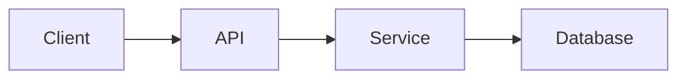

# RFC Template Standard

## Revision History

| Version | Date | Description |
|---------|------|-------------|
| 1.0.0 | YYYY-MM-DD | Initial enterprise RFC template standard. |
| 1.1.0 | YYYY-MM-DD | Reorganized into governance, analysis, design, delivery, and closure parts; removed duplication; added decision log and aligned governance structure. |

---

## Table of Contents

1. [PART I — Governance](#part-i--governance)
2. [PART II — Problem Definition](#part-ii--problem-definition)
3. [PART III — Existing System Analysis](#part-iii--existing-system-analysis)
4. [PART IV — Solution Design](#part-iv--solution-design)
5. [PART V — Impact Assessment](#part-v--impact-assessment)
6. [PART VI — Delivery Strategy](#part-vi--delivery-strategy)
7. [PART VII — Governance & Closure](#part-vii--governance--closure)

---

# PART I — Governance

## 1. Purpose

### Objective

This template defines the official structure for every Request for Comments (RFC) created within the AURA Engineering Specification repository.

Every engineering proposal that may influence architecture, product behavior, business logic, infrastructure, APIs, databases, security, or operational procedures SHALL be documented using this template.

The objective of this template is to ensure that every engineering proposal is:

- Structured
- Reviewable
- Traceable
- Comparable
- Maintainable
- AI-readable
- Human-readable

RFC documents exist to support engineering decision-making before implementation begins.

Implementation SHALL never become the primary source of engineering decisions.

### Intended Use

Use this template when proposing a change that could affect:

- System architecture
- Domain boundaries
- API contracts
- Database schema
- Security posture
- Infrastructure design
- Operational process
- Engineering governance

### Non-Use Cases

Do not use this template for:

- Informal ideas
- Meeting notes
- Temporary brainstorming
- Routine status updates
- Task tracking notes

---

## 2. Scope

This template applies to every engineering RFC inside the repository.

Including but not limited to:

- New features
- Architectural changes
- Database redesign
- Infrastructure changes
- Security improvements
- API modifications
- Performance optimizations
- Product behavior changes
- Engineering processes
- Internal standards

This template does not apply to:

- Bug reports
- User documentation
- Meeting notes
- Release notes
- Temporary design discussions

---

## 3. RFC Philosophy

An RFC is not implementation documentation.

An RFC is an engineering proposal.

Its responsibility is to answer:

- Why should this change exist?
- What problem does it solve?
- What alternatives were considered?
- What are the consequences?
- What risks are introduced?
- How will success be measured?

An RFC should enable another engineer to understand the engineering reasoning without requiring verbal explanation from the author.

An RFC SHOULD favor clarity over cleverness.

An RFC SHOULD favor explicit trade-offs over vague optimism.

An RFC MUST describe the problem before the solution.

---

## 4. RFC Lifecycle

Every RFC follows the lifecycle below.

Draft

↓

Under Review

↓

Accepted

↓

Implemented

↓

Completed

↓

Deprecated

↓

Archived

Each lifecycle stage represents engineering maturity.

Only Accepted RFCs may guide implementation.

Draft RFCs must never be considered authoritative.

### Lifecycle Rules

- Draft: work in progress, not yet authoritative.
- Under Review: pending technical evaluation.
- Accepted: approved for implementation.
- Implemented: the decision has been delivered.
- Completed: the RFC outcome has been validated.
- Deprecated: no longer recommended for new work.
- Archived: preserved for historical reference.

---

## 5. RFC Categories

Every RFC shall belong to exactly one primary category.

Examples include:

- Architecture
- Backend
- Frontend
- Database
- Infrastructure
- Security
- DevOps
- Platform
- Performance
- Developer Experience
- Governance
- Documentation
- Testing
- Automation
- Business Rules

If an RFC spans multiple engineering domains, the primary category should represent its main purpose.

Secondary categories may be listed in metadata.

---

## 6. RFC Numbering

RFC identifiers are immutable.

Format:

```text
RFC-XXXX
```

Examples:

- RFC-0001
- RFC-0002
- RFC-0045
- RFC-0152

Numbers are assigned sequentially.

Numbers shall never be reused.

Archived RFCs retain their original identifiers forever.

Changing an RFC identifier is prohibited.

---

## 7. RFC Metadata

### Purpose

Metadata provides structured information about the RFC.

Metadata enables:

- Document discovery
- Automated indexing
- Ownership tracking
- Version management
- AI context loading
- Dependency analysis
- Engineering auditing

Every RFC MUST contain a valid metadata block.

### Required Metadata Schema

Every RFC SHALL begin with YAML Front Matter.

Example:

```yaml
---
document_id: RFC-0001
title: Example Engineering Proposal
status: Draft
version: 1.0.0
category: Architecture
priority: High
risk_level: Medium
owner: Architecture Team
authors:
  - Name
reviewers:
  - Name
approvers:
  - Name
created: YYYY-MM-DD
updated: YYYY-MM-DD
related_documents:
  - DOCUMENTATION_STANDARD.md
related_rfcs:
  - RFC-0000
related_adrs:
  - ADR-0000
dependencies:
  - Service Name
supersedes:
superseded_by:
tags:
  - architecture
  - backend
---
```

---

## 8. Metadata Field Definitions

### document_id

Unique identifier for the RFC.

Format:

```text
RFC-XXXX
```

Rules:

- MUST be unique.
- MUST never change.
- MUST remain attached to the document permanently.

### title

The human-readable title of the RFC.

Requirements:

- MUST describe the engineering decision.
- MUST be specific.
- SHOULD avoid implementation details.

Good:

```text
Authentication Service Architecture
```

Bad:

```text
New Auth Code
```

### status

Defines the current lifecycle stage.

Allowed values:

```text
Draft
Under Review
Accepted
Rejected
Implemented
Completed
Deprecated
Archived
```

Custom status values are prohibited.

### category

Defines the primary engineering area.

Allowed examples:

- Architecture
- Backend
- Frontend
- Database
- Security
- Infrastructure
- DevOps
- Testing
- Documentation
- Governance

An RFC MUST have one primary category.

### priority

Defines engineering importance.

Allowed values:

- Critical
- High
- Medium
- Low

Priority does not determine approval. It only determines attention level.

### risk_level

Defines potential impact.

Allowed values:

- Low
- Medium
- High
- Critical

Risk assessment MUST consider:

- Security impact
- Data impact
- Availability impact
- Business impact
- Migration complexity

### owner

Defines the responsible person or team.

Rules:

- MUST contain exactly one owner.
- Owner is responsible for maintenance.
- Owner coordinates reviews.

Multiple owners are prohibited.

### authors

Defines RFC contributors.

Rules:

- Multiple authors are allowed.
- Authors are responsible for content accuracy.
- Authors do not automatically approve the RFC.

### reviewers

Defines technical reviewers.

Reviewers evaluate:

- Correctness
- Completeness
- Architecture alignment
- Security concerns

### approvers

Defines final decision authority.

An RFC is not accepted until required approvals are completed.

### created

The initial creation date.

Format:

```text
YYYY-MM-DD
```

### updated

The latest modification date.

Every content modification MUST update this field.

### related_documents

References supporting documents.

Examples:

- Architecture specifications
- Standards
- Templates
- Guides

### related_rfcs

References other RFC documents.

Used for:

- Dependencies
- Extensions
- Historical context

### related_adrs

References architecture decisions.

Used when the RFC introduces architectural consequences.

### dependencies

Lists external or internal dependencies.

Examples:

- Authentication Service
- PostgreSQL
- Payment Provider
- Cloud Infrastructure

Dependencies must be explicit.

### supersedes

Defines previous RFCs replaced by this RFC.

Example:

```text
RFC-0010
```

### superseded_by

Defines newer RFCs replacing this RFC.

### tags

Used for searching and classification.

Examples:

- security
- database
- api
- architecture
- performance

Tags should be:

- Short
- Consistent
- Reusable

---

## 9. Document Control

### Purpose

Document Control defines the administrative information required to maintain RFC integrity throughout its lifecycle.

Every RFC SHALL contain a document control section.

### RFC Information

| Field | Value |
|---|---|
| RFC ID | RFC-XXXX |
| Title | Document Title |
| Status | Draft |
| Version | 1.0.0 |
| Category | Architecture |
| Owner | Team Name |
| Created | YYYY-MM-DD |
| Updated | YYYY-MM-DD |

### Change History

Every significant modification SHALL be recorded.

| Version | Date | Author | Change |
|---|---|---|---|
| 1.0.0 | YYYY-MM-DD | Name | Initial Draft |
| 1.1.0 | YYYY-MM-DD | Name | Added Migration Strategy |

### Review History

| Reviewer | Date | Result | Notes |
|---|---|---|---|
| Name | YYYY-MM-DD | Approved | No blocking issues |

### Decision History

Important decisions made during review should be recorded.

| Decision | Reason |
|---|---|
| Selected PostgreSQL | Existing infrastructure compatibility |

---

## 10. RFC Writing Rules

Every RFC author MUST follow these rules.

### One RFC = One Decision

An RFC should solve one primary engineering problem.

Bad:

```text
Authentication + Payments + Database Migration
```

Good:

```text
Authentication Service Architecture
```

Large changes should be divided.

### Evidence Before Opinion

RFCs should be based on:

- Requirements
- Measurements
- Existing constraints
- Technical analysis

Personal preference is not sufficient justification.

### Explain Trade-offs

Every important decision has consequences.

The RFC MUST explain:

- Benefits
- Costs
- Limitations
- Risks

### Avoid Implementation Lock-In

RFCs should define engineering direction.

They should not unnecessarily lock every implementation detail unless required.

### Keep Historical Accuracy

An RFC represents the decision process at the time it was accepted.

Do not rewrite history after implementation.

If the decision changes:

Create a new RFC.

---

# PART II — Problem Definition

## 11. Executive Summary

### Purpose

The Executive Summary provides a concise overview of the RFC.

Its objective is to allow engineers, reviewers, architects, and AI systems to understand the proposal without reading the entire document.

The summary MUST explain:

- What is being proposed.
- Why it is required.
- What problem it solves.
- What the expected impact is.

### Requirements

The Executive Summary SHOULD be:

- Short
- Precise
- Decision-focused
- Free from implementation details

Recommended length:

3–8 paragraphs.

### Template

```markdown
# Executive Summary

## Overview

[Describe the proposed change.]

## Motivation

[Explain why this RFC exists.]

## Expected Outcome

[Describe the expected result.]

## Impact Summary

[Describe affected systems, teams, or domains.]
```

---

## 12. Problem Statement

### Purpose

The Problem Statement defines the engineering problem this RFC intends to solve.

A solution without a clearly defined problem creates unnecessary complexity.

Every RFC MUST contain a measurable problem statement.

### Problem Definition

The problem statement SHOULD answer:

- What is currently wrong?
- Who is affected?
- What limitations exist?
- What happens if no action is taken?

### Template

```markdown
# Problem Statement

## Current Problem

[Describe the existing problem.]

## Impact

[Describe technical, business, or operational impact.]

## Affected Areas

[List affected systems or teams.]

## Consequences

[Describe consequences of not solving the problem.]
```

### Good Example

```markdown
The current notification system processes messages synchronously.

During peak traffic, response latency increases because user requests wait for notification delivery.

This affects user experience and limits system scalability.
```

### Bad Example

```markdown
The notification system is bad and needs improvement.
```

### Problem Validation

Before proposing a solution, verify:

- Is the problem measurable?
- Is the problem real?
- Is the impact understood?
- Are affected systems identified?

---

# PART III — Existing System Analysis

## 13. Background

### Purpose

The Background section provides historical and technical context.

It explains how the current situation developed.

### Requirements

Background SHOULD include:

- Previous decisions
- Existing architecture
- Historical constraints
- Previous attempts
- Relevant context

### Template

```markdown
# Background

## Existing Context

[Describe current environment.]

## Historical Decisions

[List previous decisions.]

## Previous Attempts

[Describe previous solutions if applicable.]

## Current Limitations

[Explain remaining limitations.]
```

### Rules

Background is not a problem statement.

Background explains:

- How did we get here?

Problem Statement explains:

- What is wrong?

---

## 14. Goals

### Purpose

Goals define what the RFC intends to achieve.

Goals MUST describe desired outcomes.

### Goal Requirements

Every goal SHOULD be:

- Specific
- Measurable
- Achievable
- Relevant
- Testable

### Template

```markdown
# Goals

The RFC aims to achieve:

1. [Goal]
2. [Goal]
3. [Goal]
```

### Example

Good:

```markdown
Reduce authentication service response latency from 500ms to below 150ms.
```

Bad:

```markdown
Make authentication faster.
```

### Goal Limit

An RFC SHOULD contain:

- Minimum: 1 goal
- Recommended: 3–7 goals

Too many goals indicate multiple RFCs are combined.

---

## 15. Non-Goals

### Purpose

Non-Goals explicitly define what this RFC will NOT solve.

This prevents scope expansion.

### Importance

Many engineering projects fail because expectations are not controlled.

Non-goals protect:

- Engineering focus
- Timeline
- Architecture boundaries
- Review clarity

### Template

```markdown
# Non-Goals

This RFC does not address:

- [Excluded topic]
- [Excluded topic]
- [Excluded topic]
```

### Example

```markdown
This RFC does not redesign the entire user management system.

It only introduces the authentication token validation service.
```

---

## 16. Success Criteria

### Purpose

Success Criteria define how the RFC outcome will be evaluated.

A proposal without measurable success criteria cannot be validated.

### Requirements

Success criteria SHOULD include:

- Technical metrics
- Business metrics
- Operational metrics

### Template

```markdown
# Success Criteria

The RFC is considered successful when:

| Metric | Target |
|---|---|
| Latency | <150ms |
| Availability | 99.9% |
| Error Rate | <1% |
```

### Success Criteria Rules

Success criteria MUST be:

- Observable
- Measurable
- Relevant

Avoid:

- "The system should be better."

Prefer:

- "The system should support 10,000 concurrent users."

---

## 17. Requirements

### Purpose

Requirements define mandatory capabilities introduced by the RFC.

Requirements convert business or engineering needs into implementable rules.

### Requirement Types

#### Functional Requirements

Describe system behavior.

Example:

"The API SHALL validate JWT tokens before granting access."

#### Non-Functional Requirements

Describe system qualities.

Examples:

- Performance
- Security
- Availability
- Scalability
- Reliability

### Template

```markdown
# Requirements

## Functional Requirements

- Requirement 1
- Requirement 2

## Non-Functional Requirements

- Performance: [Requirement]
- Security: [Requirement]
- Availability: [Requirement]
```

### Requirement Language

Use normative terms:

- MUST
- SHOULD
- MAY
- MUST NOT
- SHOULD NOT

### Example

Correct:

"The service MUST encrypt sensitive user data at rest."

Incorrect:

"The service should probably protect data."

---

## 18. Current State

### Purpose

The Current State section describes the existing system, architecture, process, or behavior before the proposed change.

Its purpose is to create a shared understanding of the starting point.

Every reviewer MUST understand the current state before evaluating the proposed solution.

### Required Information

The Current State section SHOULD include:

- Existing architecture
- Existing workflows
- Current limitations
- Known problems
- Technical constraints
- Existing dependencies

### Template

```markdown
# Current State

## Overview

[Describe the existing system.]

## Architecture

[Describe current architecture.]

## Workflow

[Describe current behavior.]

## Limitations

[List current limitations.]

## Dependencies

[List current dependencies.]
```

### Architecture Description Rules

Architecture descriptions SHOULD include:

- Components
- Responsibilities
- Communication flow
- Data flow
- External dependencies

Avoid describing implementation details that do not affect the decision.

### Diagrams

Architecture diagrams SHOULD be included when complexity requires them.

Preferred formats:

- Mermaid
- PlantUML
- Draw.io

Example:



---

## 19. Constraints

### Purpose

Constraints define limitations that influence the proposed solution.

Constraints are not problems.

They are boundaries.

### Constraint Categories

#### Technical Constraints

Examples:

- Existing technology stack
- Database limitations
- API limitations

#### Business Constraints

Examples:

- Budget
- Timeline
- Regulatory requirements

#### Operational Constraints

Examples:

- Deployment restrictions
- Maintenance requirements

#### Security Constraints

Examples:

- Compliance requirements
- Data protection rules

### Template

```markdown
# Constraints

## Technical Constraints

- Constraint

## Business Constraints

- Constraint

## Operational Constraints

- Constraint

## Security Constraints

- Constraint
```

---

## 20. Assumptions

### Purpose

Assumptions identify information considered true during RFC development.

Hidden assumptions create engineering risk.

Every important assumption MUST be documented.

### Template

```markdown
# Assumptions

The RFC assumes:

1. [Assumption]
2. [Assumption]
3. [Assumption]
```

### Assumption Rules

Every assumption SHOULD have:

- Owner
- Validation method
- Impact if incorrect

Example:

| Assumption | Validation | Impact |
|---|---|---|
| API availability | Monitoring | Service failure |

---

## 21. Dependencies

### Purpose

Dependencies describe external or internal components required for implementation.

### Dependency Categories

#### Internal Dependencies

Examples:

- Services
- Databases
- Internal APIs
- Shared libraries

#### External Dependencies

Examples:

- Cloud providers
- Third-party APIs
- External services

### Template

```markdown
# Dependencies

| Dependency | Type | Purpose |
|---|---|---|
| Service A | Internal | Authentication |
| Provider B | External | Payments |
```

### Dependency Rules

Dependencies MUST be:

- Explicit
- Reviewed
- Maintained

Unknown dependencies are engineering risks.

---

# PART IV — Solution Design

## 22. Proposed Solution

### Purpose

The Proposed Solution defines the recommended engineering approach.

This is the main decision section of the RFC.

### Solution Requirements

The proposed solution MUST explain:

- What will change
- Why this approach was selected
- How it solves the problem
- What components are affected

### Template

```markdown
# Proposed Solution

## Overview

[Describe solution.]

## Architecture

[Describe architecture changes.]

## Components

[List affected components.]

## Workflow

[Describe new behavior.]

## Implementation Notes

[Important implementation considerations.]
```

### Solution Principles

The proposed solution SHOULD prioritize:

- Simplicity
- Maintainability
- Security
- Scalability
- Reliability

The most complex solution is not automatically the best solution.

---

## 23. Design Details

### Purpose

This section explains important design decisions.

It should describe the reasoning behind the implementation approach.

### Template

```markdown
# Design Details

## Component Design

[Explain component responsibilities.]

## Data Flow

[Explain data movement.]

## Control Flow

[Explain execution flow.]

## Failure Handling

[Explain failure scenarios.]
```

### Separation of Concerns

Design descriptions SHOULD clearly separate:

- Responsibilities
- Interfaces
- Dependencies
- Boundaries

---

## 24. Alternatives Considered

### Purpose

Every significant engineering decision SHOULD document alternatives.

The goal is not to prove the chosen solution is perfect.

The goal is to show that other options were evaluated.

### Template

```markdown
# Alternatives Considered

## Alternative 1

### Description

[Describe alternative.]

### Advantages

- Advantage

### Disadvantages

- Disadvantage

## Alternative 2

### Description

[Describe alternative.]

### Advantages

- Advantage

### Disadvantages

- Disadvantage
```

### Alternative Evaluation Matrix

| Option | Benefits | Risks | Decision |
|---|---|---|---|
| Option A | Fast implementation | Limited scale | Rejected |
| Option B | Scalable | Higher complexity | Selected |

---

## 25. Decision Rationale

### Purpose

Explains why the proposed solution was selected.

### Template

```markdown
# Decision Rationale

The selected solution was chosen because:

- Reason 1
- Reason 2
- Reason 3
```

### Decision Rules

A decision SHOULD consider:

- Technical suitability
- Long-term maintenance
- Cost
- Security
- Scalability
- Team capability

---

## 26. Trade-offs

### Purpose

Every engineering decision creates advantages and disadvantages.

A professional RFC documents both.

### Template

```markdown
# Trade-offs

## Benefits

- Benefit

## Costs

- Cost

## Accepted Risks

- Risk
```

### Trade-off Categories

Consider:

#### Complexity

Does this increase system complexity?

#### Performance

Does this improve or reduce performance?

#### Cost

Does this increase operational cost?

#### Maintainability

Does this simplify or complicate future changes?

#### Security

Does this introduce security concerns?

### Trade-off Principle

The objective is not eliminating all trade-offs.

The objective is making them explicit.

---

# PART V — Impact Assessment

## 27. Impact Assessment

### Purpose

Impact Assessment evaluates the engineering consequences of the proposed change across the entire system.

Its objective is to ensure that every affected domain has been analyzed before implementation begins.

The assessment SHOULD identify:

- Systems affected
- Engineering risks
- Operational consequences
- Required follow-up work
- Long-term implications

### 27.1 Architecture Impact

#### Purpose

Evaluates how the proposal changes the overall software architecture.

#### Engineering Considerations

- Components added
- Components modified
- Components removed
- Dependency changes
- Boundary changes
- Communication changes

#### Assessment Template

| Item | Impact | Notes |
|------|--------|------|
| Component | Low / Medium / High | Description |

### 27.2 Domain Impact

#### Purpose

Evaluates changes affecting business rules and domain behavior.

#### Engineering Considerations

- Business rules modified
- New domain entities
- Existing entity changes
- Domain ownership
- Domain consistency

#### Assessment Template

| Domain | Impact | Notes |
|------|--------|------|
| Domain | Low / Medium / High | Description |

### 27.3 API Impact

#### Purpose

Evaluates changes affecting public or internal APIs.

#### Engineering Considerations

- Endpoint changes
- Contract changes
- Versioning
- Authentication
- Authorization
- Compatibility

#### Assessment Template

| API | Change Type | Compatibility |
|------|------------|--------------|
| /endpoint | Modified | Backward Compatible |

### 27.4 Database Impact

#### Purpose

Evaluates persistence-layer modifications.

#### Engineering Considerations

- Schema changes
- Indexes
- Constraints
- Data migration
- Storage growth

#### Assessment Template

| Object | Change | Notes |
|------|--------|------|
| Table | Modified | Description |

### 27.5 Security Impact

#### Purpose

Evaluates changes affecting the security posture.

#### Engineering Considerations

- Authentication
- Authorization
- Secrets
- Encryption
- Audit Logs
- Compliance

#### Assessment Template

| Area | Impact | Mitigation |
|------|--------|-----------|
| Authentication | Medium | MFA |

### 27.6 Performance Impact

#### Purpose

Evaluates resource consumption and runtime performance.

#### Engineering Considerations

- CPU
- Memory
- Storage
- Network
- Latency
- Throughput

#### Metrics Template

| Metric | Current | Target |
|------|---------|--------|
| Latency | 220ms | <100ms |

### 27.7 Scalability Impact

#### Purpose

Evaluates long-term growth capability.

#### Engineering Considerations

- Horizontal scaling
- Vertical scaling
- Statelessness
- Bottlenecks
- Capacity planning

#### Assessment Template

| Area | Current | Future |
|------|----------|--------|
| Requests/sec | 1k | 10k |

### 27.8 Reliability Impact

#### Purpose

Evaluates stability and fault tolerance.

#### Engineering Considerations

- Availability
- Error handling
- Recovery
- Retry strategy
- Backup
- Disaster recovery

#### Assessment Template

| Area | Strategy |
|------|----------|
| Recovery | Automatic |

### 27.9 Operational Impact

#### Purpose

Evaluates operational consequences after deployment.

#### Engineering Considerations

- Deployment
- Monitoring
- Alerting
- Logging
- Maintenance
- Documentation
- Support

#### Assessment Template

| Area | Required Action |
|------|-----------------|
| Monitoring | Add new dashboard |

### Impact Summary

Every RFC SHOULD conclude the Impact Assessment with a concise summary.

| Category | Overall Impact |
|----------|----------------|
| Architecture | Low |
| Security | Medium |
| Performance | Low |
| Database | High |
| Operations | Medium |

This summary provides reviewers with a high-level understanding of the proposal before moving to implementation planning.

---

# PART VI — Delivery Strategy

## 28. Implementation Strategy

### Purpose

The Implementation Strategy describes how the approved RFC will be transformed into production-ready software.

This section bridges engineering design and engineering execution.

An implementation strategy SHOULD reduce uncertainty before development begins.

### Implementation Principles

Implementation SHOULD prioritize:

- Small incremental changes
- Low deployment risk
- Reversible deployments
- Observable progress
- Continuous validation

Large "Big Bang" implementations SHOULD be avoided whenever possible.

### Recommended Workflow

```text
Planning
↓
Preparation
↓
Implementation
↓
Validation
↓
Deployment
↓
Monitoring
↓
Completion
```

Each stage should produce measurable outputs before progressing to the next stage.

---

## 29. Migration Strategy

### Purpose

Defines how the existing system transitions to the proposed solution.

Migration planning is mandatory whenever:

- Data changes
- APIs change
- Infrastructure changes
- Architecture changes
- User behavior changes

### Migration Types

#### In-place Migration

Replace the existing implementation directly.

Advantages:

- Simple

Disadvantages:

- Higher operational risk

#### Parallel Migration

Old and new systems operate simultaneously.

Advantages:

- Lower deployment risk
- Easier rollback

Disadvantages:

- Temporary operational complexity

#### Phased Migration

System changes occur incrementally.

Advantages:

- Lowest operational risk
- Easier validation

Recommended whenever feasible.

### Migration Checklist

- Migration prerequisites completed
- Backup verified
- Rollback prepared
- Monitoring enabled
- Documentation updated
- Stakeholders informed

---

## 30. Rollout Strategy

### Purpose

Defines how the change reaches production.

Deployment is not equivalent to rollout.

Software may be deployed long before users receive the feature.

### Recommended Rollout Levels

1. Development
2. Internal Testing
3. Staging
4. Limited Production
5. General Availability

### Feature Flag Recommendation

Whenever possible, new functionality SHOULD be protected behind feature flags.

Benefits include:

- Safer deployment
- Easier rollback
- Progressive exposure
- Faster incident response

### Rollout Example

| Phase | Users | Goal |
|-------|------|------|
| Internal | Engineering Team | Validation |
| Beta | 5% | Observe behavior |
| Limited | 25% | Detect issues |
| Production | 100% | Full release |

---

## 31. Validation Strategy

### Purpose

Defines how the implementation will be verified.

Validation confirms that implementation satisfies the approved RFC.

### Validation Categories

#### Functional Validation

Verify expected behavior.

#### Integration Validation

Verify component interaction.

#### Performance Validation

Verify performance targets.

#### Security Validation

Verify security requirements.

#### Operational Validation

Verify deployment readiness.

### Validation Checklist

- Functional tests passed
- Integration tests passed
- Performance verified
- Security review completed
- Monitoring operational
- Documentation updated

---

## 32. Rollback Strategy

### Purpose

Every production deployment MUST include a rollback strategy.

Rollback planning is mandatory.

### Rollback Triggers

Rollback SHOULD be considered when:

- Critical production errors
- Data corruption
- Security incident
- Severe performance degradation
- Availability reduction

### Rollback Checklist

- Previous version available
- Database rollback defined
- Infrastructure rollback verified
- Feature flags prepared
- Recovery tested

### Recovery Objectives

The RFC SHOULD define:

| Metric | Target |
|---------|--------|
| Recovery Time Objective (RTO) | Defined |
| Recovery Point Objective (RPO) | Defined |

---

## 33. Success Measurement

### Purpose

Defines how engineering success will be measured after deployment.

Implementation completion is not success.

Successful outcomes are measured using objective metrics.

### Measurement Categories

#### Technical Metrics

Examples:

- Response time
- CPU usage
- Memory usage
- Error rate

#### Operational Metrics

Examples:

- Deployment success rate
- Incident count
- Recovery time

#### Business Metrics

Examples:

- User adoption
- Conversion improvement
- Cost reduction

### Success Dashboard

| Metric | Baseline | Target | Result |
|---------|----------|--------|--------|
| Latency | 220ms | <100ms | TBD |
| Availability | 99.5% | 99.9% | TBD |
| Error Rate | 2% | <0.5% | TBD |

---

## 34. Open Questions

### Purpose

Not every engineering question is answered before approval.

Remaining uncertainties should be documented explicitly.

### Template

| Question | Owner | Resolution Required Before |
|----------|-------|----------------------------|
| Question | Team | Implementation |

Open questions SHOULD decrease over time.

Accepted RFCs should contain only non-blocking open questions.

---

# PART VII — Governance & Closure

## 35. Decision Log

### Purpose

The Decision Log records significant decisions made during the lifecycle of the RFC.

Its objective is to preserve engineering reasoning and prevent the loss of historical context.

Engineering decisions SHOULD remain traceable long after implementation has completed.

### Decision Log Template

| Date | Decision | Reason | Decision Owner |
|------|----------|--------|----------------|
| YYYY-MM-DD | Selected PostgreSQL | Existing operational expertise | Architecture Team |

### Decision Rules

Record decisions that:

- Change the proposed solution
- Affect architecture
- Modify scope
- Introduce significant risk
- Alter implementation strategy

Do not record:

- Editorial changes
- Formatting updates
- Typographical corrections

---

## 36. Review Checklist

### Purpose

Ensures that every RFC is reviewed consistently before approval.

The checklist is intended for reviewers, not authors.

### Technical Review

- Problem is clearly defined.
- Scope is appropriate.
- Goals are measurable.
- Non-goals are explicit.
- Proposed solution addresses the stated problem.
- Alternatives have been evaluated.
- Trade-offs are documented.
- Risks have been assessed.
- Dependencies are identified.
- Success criteria are measurable.

### Architecture Review

- Architecture remains consistent.
- Domain boundaries are respected.
- Component responsibilities are clear.
- Interfaces are well defined.
- Scalability has been evaluated.

### Security Review

- Authentication considered.
- Authorization considered.
- Sensitive data protected.
- Compliance requirements reviewed.
- Security risks documented.

### Operational Review

- Monitoring planned.
- Logging considered.
- Rollback strategy defined.
- Migration strategy documented.
- Deployment approach validated.

---

## 37. Approval

### Purpose

Approval confirms that the RFC has completed the required review process.

An RFC SHALL NOT be implemented until all required approvals have been obtained.

### Approval Record

| Role | Name | Status | Date |
|------|------|--------|------|
| Author | | Approved | |
| Reviewer | | Approved | |
| Architecture | | Approved | |
| Security | | Approved | |
| Product | | Approved | |

### Approval Rules

An approval indicates that the reviewer:

- Has read the RFC.
- Understands the proposal.
- Accepts the documented trade-offs.
- Supports implementation.

Approval does not imply ownership of implementation.

---

## 38. Revision History

### Purpose

Tracks significant revisions made to the RFC after publication.

Maintaining revision history improves traceability and supports future audits.

### Revision History Template

| Version | Date | Author | Summary |
|---------|------|--------|---------|
| 1.0.0 | YYYY-MM-DD | Name | Initial publication |
| 1.1.0 | YYYY-MM-DD | Name | Improved migration strategy |

### Versioning

RFC documents SHOULD follow Semantic Versioning:

- Major: structural or governance changes.
- Minor: new content or expanded guidance.
- Patch: editorial corrections and clarifications.

---

## 39. References

### Purpose

Lists documents that support or influenced the RFC.

References improve traceability and provide additional context.

### Reference Categories

#### Internal References

Examples:

- ADRs
- RFCs
- Standards
- Architecture documents
- Design specifications

#### External References

Examples:

- IETF RFCs
- ISO standards
- NIST publications
- OWASP documentation
- Vendor documentation

### References Template

```markdown
## References

- ADR-0003
- RFC-0012
- Architecture Standard
- NIST SP 800-53
- OWASP ASVS
```

---

## 40. Glossary

### Purpose

Defines terminology used throughout the RFC.

A shared vocabulary improves consistency and reduces ambiguity.

### Example

| Term | Definition |
|------|------------|
| RFC | Request for Comments |
| ADR | Architecture Decision Record |
| API | Application Programming Interface |
| SLA | Service Level Agreement |
| RTO | Recovery Time Objective |
| RPO | Recovery Point Objective |

Additional project-specific terms SHOULD be added when necessary.

---

## 41. Final RFC Checklist

### Purpose

Provides a final validation before an RFC is accepted.

This checklist should be completed immediately prior to approval.

### Final Validation

#### Document Quality

- Metadata completed.
- Executive Summary written.
- Problem clearly defined.
- Goals documented.
- Non-goals documented.
- Success criteria measurable.

#### Engineering Quality

- Current state documented.
- Proposed solution complete.
- Alternatives evaluated.
- Trade-offs documented.
- Constraints identified.
- Assumptions documented.
- Dependencies listed.

#### Operational Readiness

- Migration strategy completed.
- Rollout strategy defined.
- Rollback strategy documented.
- Monitoring considered.
- Success metrics established.

#### Governance

- Review completed.
- Decision Log updated.
- Revision History updated.
- References verified.
- Glossary reviewed.
- Required approvals obtained.

---

## Document Completion

An RFC is considered complete when:

1. All mandatory sections are present.
2. Required reviews have been completed.
3. Required approvals have been granted.
4. Implementation may begin.
5. The document becomes the authoritative engineering reference for the approved change.

Future modifications to the engineering decision SHALL be documented through a new RFC or by formally superseding the current RFC.

---

# End of Document
